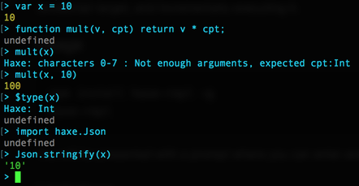

# Haxe REPL

> A Read-Eval-Print-Loop (REPL) is a simple, interactive computer programming environment
> that takes single user inputs (i.e. single expressions), evaluates them, and returns
> the result to the user; a program written in a REPL environment is executed piecewise.

This REPL runs on top of NodeJS's native REPL support, compiling Haxe code against
the JavaScript target, and *incrementally* executing it, while retaining full access
to the Haxe strict compiler typing, libraries, and even your own classes.

## Installation

Install globally:

    npm install haxe-repl -g
    haxe-repl

Or run without installation using `npx`:

    npx haxe-repl

## Usage

    # defaults to current folder as classpath
    haxe-repl

    # add extra compiler arguments normally
    haxe-repl -lib hxnodejs -cp src -D my_define

The Haxe version will be printed, and you will be presented with a prompt
where you can enter and execute Haxe code line by line.

## Tips

- Haxe compiler is expected to be available in the PATH
- Hardcoded flags: `-D js-classic -D nodejs --no-inline --no-opt -dce no`
- To use Haxe Sys or NodeJS API add `-lib hxnodejs`
- Node `require` is exposed without the need for using `js.Lib.require`
- Node REPL dot commands are supported: try `.help`, `.clear`...

## Limitations

Only "body code" is allowed, which means:
- you can define variables and functions,
- you can NOT define types (e.g. `class`, `enum`...).

However you can `import` and `using` types, and evalute types using `$type(v)`.

## Troubleshooting

Enter `$` as command and the REPL will print the current imports and command history.
